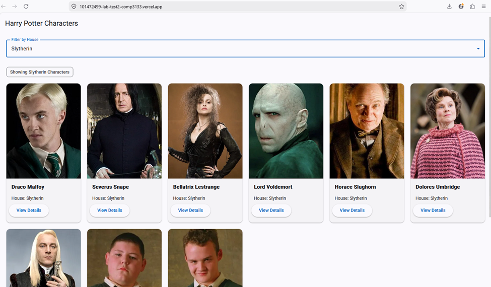
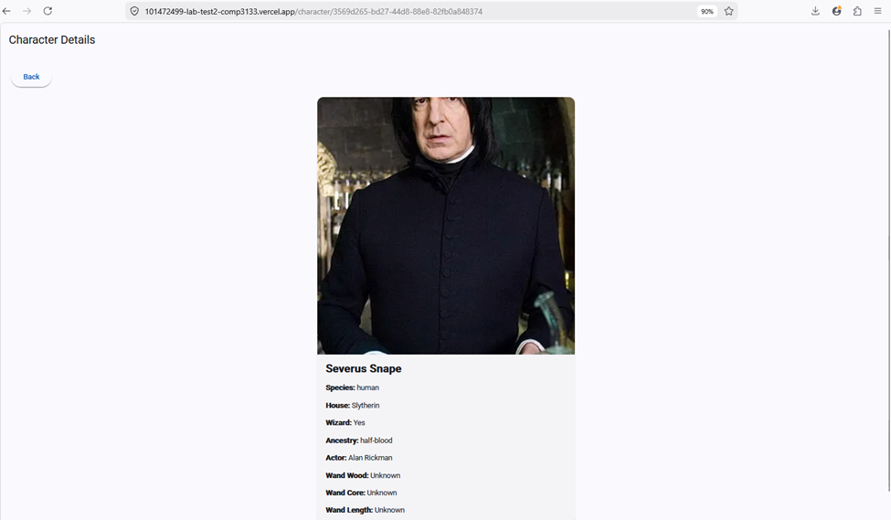
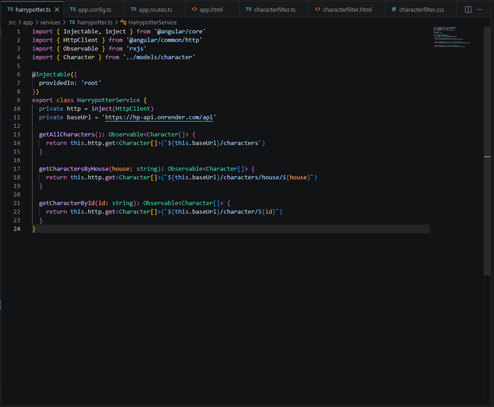
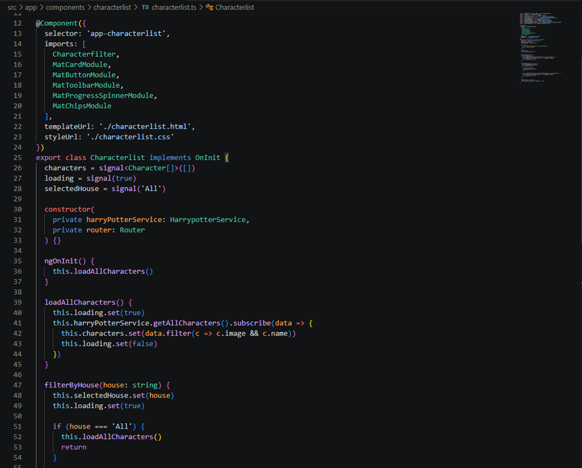

# COMP 3133 Lab Test 2

## Student Information

* Name: Viktor Grygoriev
* Student ID: 101472499
* Course: COMP 3133

## Theme

Harry Potter Theme

## Project Description

This Angular application fetches and displays Harry Potter character data using a public REST API.

The app allows users to:

* view a list of Harry Potter characters
* filter characters by house
* view detailed information for a selected character

## Features Implemented

* Angular latest version
* HttpClient integration
* Character list component
* Character filter component
* Character details component
* Service for API calls
* TypeScript interface for character data
* Angular Material UI
* Filter by house
* Use of `@for`
* Use of `@if`
* Use of `@switch`
* Use of `signal`

## API Used

Harry Potter API:
https://hp-api.onrender.com/

## Components

* `characterlist`
* `characterfilter`
* `characterdetails`

## Project Structure

* `src/app/components` → Angular components
* `src/app/services` → API service
* `src/app/models` → TypeScript interfaces

## How to Run the Project Locally

```bash
npm install
ng serve
```

Then open:

```text
http://localhost:4200
```

## Deployment Link

https://101472499-lab-test2-comp3133.vercel.app/

## GitHub Repository

https://github.com/LynxGVA/101472499-lab-test2-comp3133

## Screenshots

### Character List


### Filter by House



### Character Details



### Service Code



### Component Code



## Author

Viktor Grygoriev
